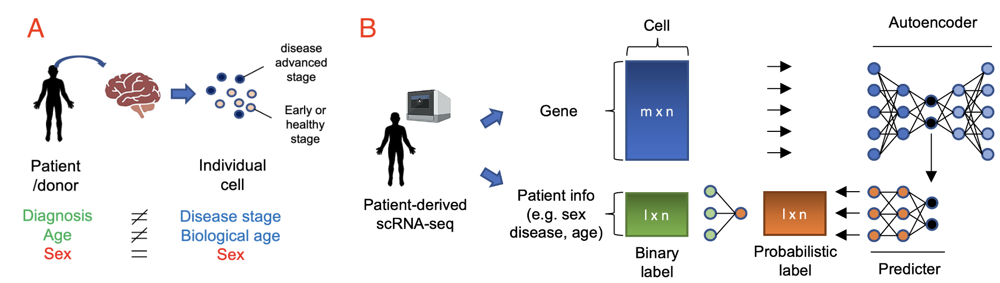

# scIDST (single-cell Identificaiton of Disease STages)
## Introduction
scIDST is designed to identify progressive disease states of individual cells from single-cell/nuclei RNA-seq (scRNA-seq) by weekly-supervised deep learning approach. Over the past decade, single-cell transcriptome profiling has been applied to various patient-derived samples to better understand and counter a variety of diseases. Comparative analysis with healthy donor data is widely implemented to identify potential genes that may be involved in disease progression. However, the patient-derived biospecimen is composed of mixture of cells in different disease stages and even contains a portion of healthy cells. Such high heterogeneity obscures differential expression between patient and healthy donors and hinders identification of bona fide disease-associated gene expression patterns. To overcome the heterogeneous disease states in patient-derived single-cell data, scIDST infers disease progression level of individual cells with weak supervision approach and segregate diseased cells from healthy or early disease stage cells. 


## Requirement
The Python package requirements are in the file `requirements.txt`.

## How to start
```{r eval=FALSE}
git clone https://github.com/ytanaka-bio/scIDST
cd scIDST
pip install -r requirements.txt --user
```
## Preprocessing
Map raw sequence data to reference genome by [CellRanger](https://support.10xgenomics.com/single-cell-gene-expression/software/pipelines/latest/what-is-cell-ranger). File set of sparse matrix generated by CellRanger (matrix.mtx.gz, features.tsv.gz, and barcodes.tsv.gz) will be used as input of scIDST.

## How to use
1. Dimensional Reduction by autoencoder (multi thread (-t) is recommended)
```{r eval=FALSE}
$ python autoencoder.py matrix/outs/filtered_feature_bc_matrix/ reduced_data.csv -x 100 -t 8 -p autoencode
```
2. Convertion of binary label into probablistic label
```{r eval=FALSE}
$ python reef_analysis.py reduced_data.csv label.csv disease -o disease_plabel.csv
$ python reef_analysis.py reduced_data.csv label.csv age -o age_plabel.csv
$ python reef_analysis.py reduced_data.csv label.csv sex -o sex_plabel.csv
$ python convert_label.py -f disease age sex -w disease_plabel.csv age_plabel.csv sex_plabel.csv -p label.csv -o label_ws.csv
```
3. Training a neural network model with probablistic label
```{r eval=FALSE}

```

## Tips
### Prepare binary label in R
When label table will be generated by R, please save the table with `col.names=F` as follow:
```{r eval=FALSE}
> head(label)
                     disease age sex
AAACAGCCAACGTGCT-1_1       0   1   1
AAACAGCCACAACAAA-1_1       0   1   1
AAACATGCAATAACGA-1_1       0   1   1
AAACCGAAGGACCGCT-1_1       0   1   1
AAACCGAAGTGTTGTA-1_1       0   1   1
AAACCGCGTTACATCC-1_1       0   1   1
> write.table(label,"label.csv",sep=",",quote=F,col.names=F)
```
### Convert Seurat object to the sparse matrix file set
```{r eval=FALSE}
> source("R_utils/sgMatrix_table.R") #Require Seurat, Matrix, and R.utils libraries.
> sgMatrix_table(seurat,"matrix")
```

## Citation
Paper in preparation

## Reference
P. Varma, C. Re, Snuba: automating weak supervision to label training data. Processings of VLDB Endowment 12, 223-236 (2018). [PubMed](https://pubmed.ncbi.nlm.nih.gov/31777681/)
